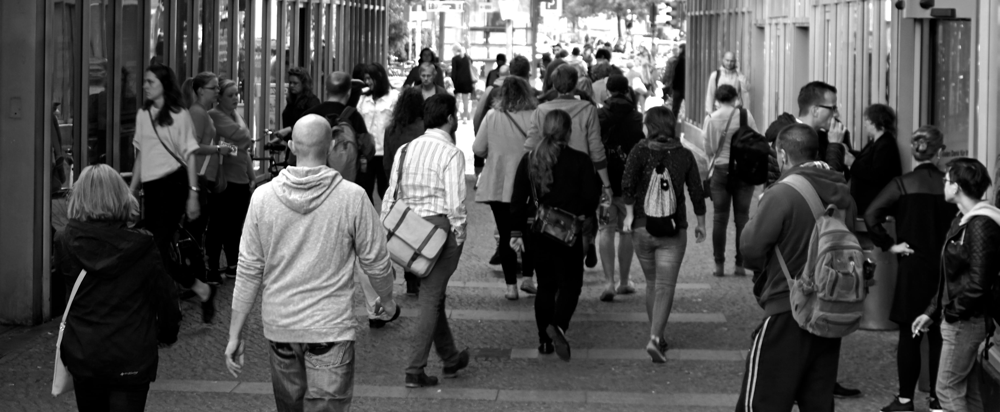
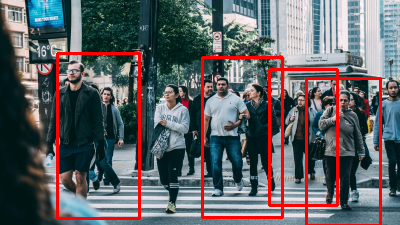
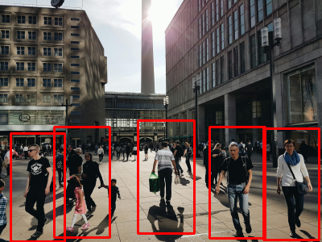
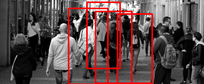

# Pedestrian Detector

## Project Overview
This project is a beginner-friendly pedestrian detection system that utilizes OpenCV and the HOG (Histogram of Oriented Gradients) algorithm. It serves as a practical introduction to image processing and machine learning concepts for those starting their journey in computer vision.

## Features
- Detects pedestrians in images using HOG and SVM.
- Real-Time Camera Pedestrian Tracking

## Sample Images
Here are some examples of the images processed by the pedestrian detector:

### Input Images




### Detected Images




## Getting Started
To get started with this project, clone the repository and ensure you have the necessary libraries installed:

### Prerequisites
- Python 3.x
- OpenCV
- imutils

### Installation
1. Clone the repository:
   ```bash
   git clone https://github.com/Aditya-Ranjan1234/Pedestrian_Detector.git

### Acknowledgment
This project is inspired by the learning resources available on Geeks for Geeks. It serves as a foundational exercise for understanding computer vision techniques using OpenCV.
